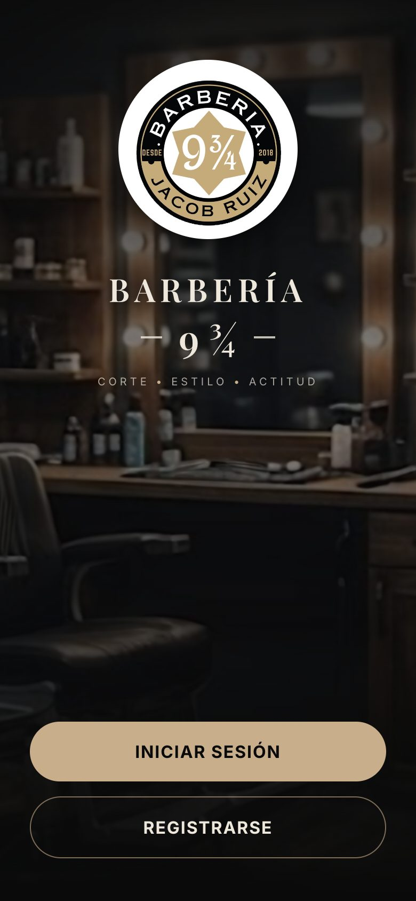
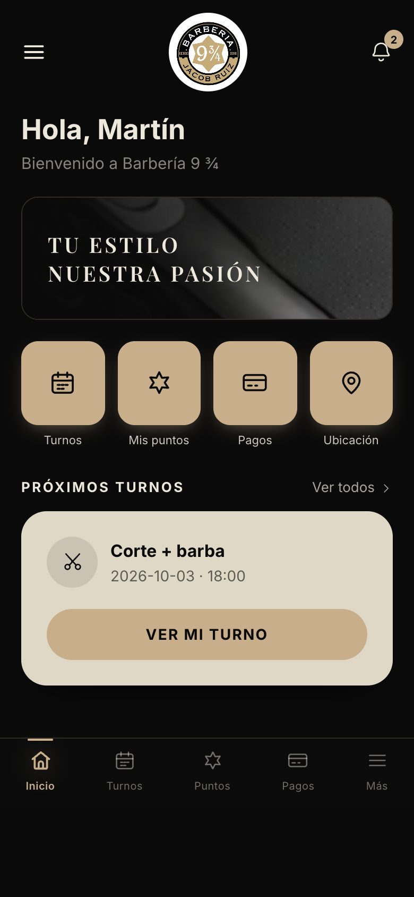
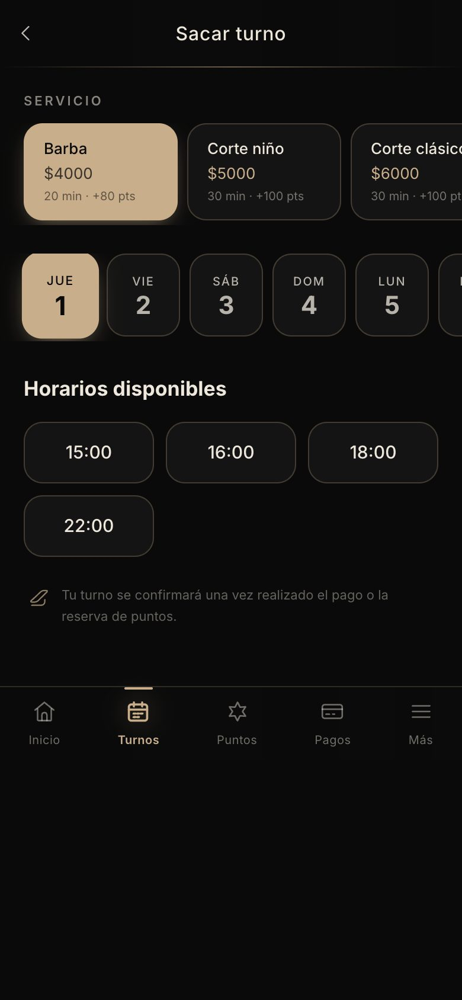
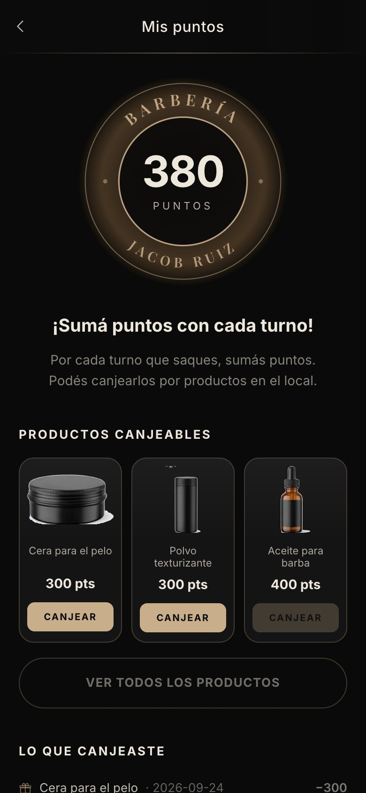
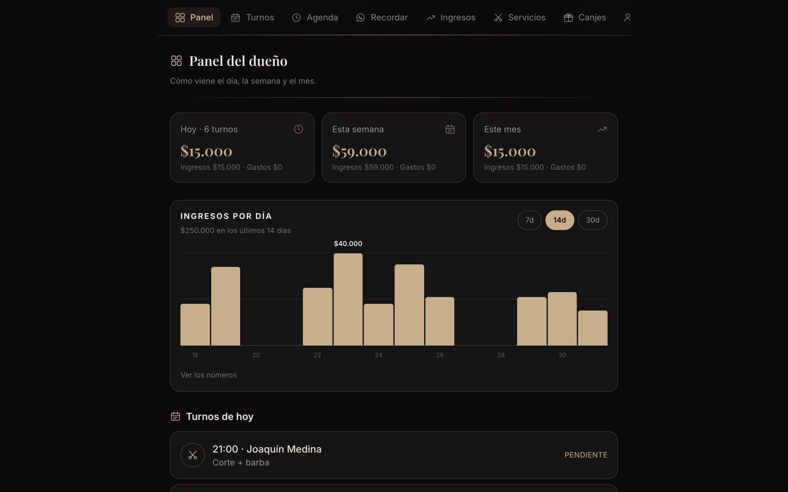
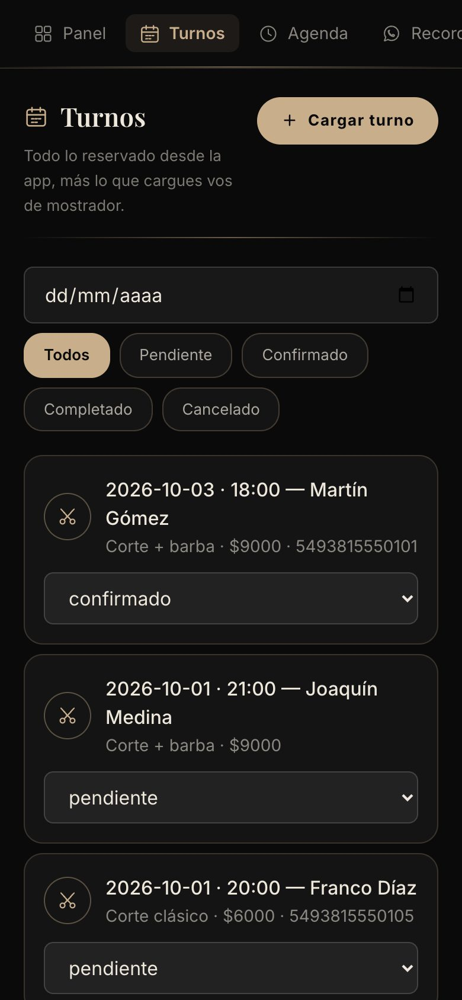

# Barbería 9 ¾ · Turnos, puntos y caja de la barbería

App web para la Barbería 9 ¾ de Jacob Ruiz, en Famaillá (Tucumán). Los clientes sacan turno desde el celular, suman puntos con cada corte y los canjean por productos. El dueño maneja todo desde un panel: la agenda, los turnos de la app y los de mostrador, los recordatorios por WhatsApp, el catálogo y la caja del día, la semana y el mes.

El diseño sale de la barbería misma: fondo negro, arena dorada para lo que se toca y crema para leer, el sello redondo del local como medallón de puntos y el poste de barbero girando. Se instala como app en la pantalla de inicio y funciona con mala conexión.

<p align="center">
  
  
  
  
</p>

<p align="center">
  
  <br>
  <sub>Panel del dueño en la compu y listado de turnos en el celular (datos de ejemplo).</sub>
</p>

---

## Qué hace

**Para el cliente**

| | |
|---|---|
| **Sacar turno** | Elige el servicio (con precio, duración y los puntos que suma), el día y uno de los horarios libres. Elige también cómo va a pagar: efectivo, Mercado Pago o Naranja X. |
| **Mis turnos** | Ve sus próximos turnos y los pasados, y puede cancelar uno. El próximo aparece primero en el inicio. |
| **Puntos** | Cada corte completado suma puntos. El saldo se ve en el sello de la barbería y se canjea por productos del local (cera, polvo texturizante, aceite para barba). Ve lo que sumó y lo que canjeó. |
| **Avisos** | Campanita con los avisos de turno reservado, confirmado o cancelado, horario liberado, puntos sumados, puntos que ya alcanzan para un canje y producto nuevo. Si da permiso, también le llegan como notificación del celular. |
| **Ubicación** | Mapa del local, horarios de atención, enlace a Google Maps y QR para compartir la app. |
| **Cuenta** | Registro, ingreso, cambiar nombre, teléfono y contraseña, y recuperar la contraseña con un enlace que le manda el dueño. |
| **App instalable** | Se agrega a la pantalla de inicio y abre sin la barra del navegador. |

**Para el dueño**

| | |
|---|---|
| **Panel** | Ingresos, gastos y neto de hoy, la semana y el mes, gráfico de ingresos por día (7, 14 o 30 días) y los turnos de hoy. |
| **Turnos** | Todo lo reservado desde la app, con filtro por fecha y estado. Al pasar un turno a **completado** se le suman los puntos al cliente y el cobro entra a la caja, una sola vez. |
| **Turno de mostrador** | Para el que llamó o cayó sin turno: se elige un cliente o se lo crea ahí mismo. Nace confirmado y suma puntos igual que uno de la app. |
| **Agenda** | Abrir o cerrar cada día de la semana, cambiar el horario y cada cuánto sale un turno. Cerrar un día entero (feriado, vacaciones) o un horario suelto: los turnos de ahí se cancelan y se avisa a cada cliente. Al reabrir, se avisa a los clientes sin turno. |
| **Recordatorios** | Turnos de mañana (o de hoy, o de pasado) con un botón que abre WhatsApp con el mensaje ya escrito. |
| **Ingresos** | Caja con los cobros de los turnos más gastos o ingresos cargados a mano. |
| **Servicios y canjes** | Precio, duración y puntos de cada servicio. Catálogo de productos canjeables con stock y foto. Lo dado de baja se puede volver a activar. |
| **Clientes** | Buscador y ficha de cada cliente: turnos, canjes, cuánto gastó y cuándo vino por última vez. |
| **Recuperaciones** | Los pedidos de recuperar contraseña: el dueño genera el enlace y se lo manda al cliente por WhatsApp. |

**Seguridad**

- La API solo acepta pedidos desde los dominios de `ORIGENES_PERMITIDOS` (más el Vite local). Cualquier otro origen recibe 403.
- Límite de intentos por IP: 10 logins fallidos cada 10 minutos, 5 registros por hora y 5 pedidos de recuperación por hora.
- Cabeceras de seguridad con `helmet` y cuerpo de las peticiones limitado a 100 kB.
- Contraseñas con bcrypt. La sesión es un JWT que dura 30 días; si vence, la app cierra la sesión y manda al login con un aviso.
- El login contesta lo mismo con un email que no existe que con una contraseña incorrecta, y el pedido de recuperación contesta lo mismo exista o no la cuenta.
- El enlace de recuperación se guarda hasheado, sirve una sola vez y vence en una hora.
- Las fotos de productos se suben con un nombre que genera el servidor (nunca el que manda el navegador) y solo se aceptan JPG, PNG y WebP de hasta 3 MB.

## Cómo suma y canjea puntos un cliente

1. El cliente reserva un turno: queda **pendiente**.
2. El dueño lo pasa a **confirmado** y, cuando lo atiende, a **completado**.
3. Al completarlo, el backend le suma los puntos de ese servicio y registra el cobro en la caja.
4. Desde **Mis puntos** el cliente canjea los puntos por un producto: se le descuentan los puntos y baja el stock.

Por defecto, un corte clásico suma 100 puntos y una cera cuesta 300: tres cortes, una cera. Los valores se cambian desde el panel.

## Estructura

```
backend/                       API REST (Node.js + Express + SQLite)
  server.js                    arranque: CORS, helmet, rutas y /uploads
  db/
    init.js                    ⭐ esquema SQLite y migraciones automáticas
    seed.js                    servicios, horarios, productos y el usuario dueño
  routes/
    auth.js                    registro, login, contraseña y recuperación
    turnos.js                  ⭐ disponibilidad, reservas, estados (puntos y caja), mostrador, recordatorios
    puntos.js                  saldo, catálogo, canjes y fotos de productos
    agenda.js                  horarios por día y bloqueos
    ingresos.js                resumen, serie diaria y movimientos manuales
    servicios.js, usuarios.js  catálogo de servicios, clientes y perfil
    notificaciones.js          avisos y alta de las push
  lib/
    notificaciones.js          guarda cada aviso y lo manda por Web Push
    subidas.js                 subida de fotos (multer)
  middleware/auth.js           JWT y rol de dueño
  test/                        tests de los flujos de plata y puntos
frontend/                      app web mobile-first (React + Vite + Tailwind)
  src/
    pages/                     pantallas del cliente: Home, Turnos, MisTurnos, MisPuntos, Pagos,
                               Ubicacion, Notificaciones, Perfil, Login, Recuperar
    admin/                     panel del dueño: Dashboard, TurnosAdmin, Agenda, Recordatorios,
                               Ingresos, Servicios, Productos, Clientes, Recuperaciones
    components/                Icono (set propio de SVG), MedallonPuntos, BottomNav, AdminNav,
                               PanelPagina, GraficoIngresos, MapaLocal, Pantalla, BotonOnda...
    config/local.js            ⭐ dirección, coordenadas, WhatsApp, Instagram y horarios del local
    context/                   sesión y avisos
    api/client.js              axios con el token y el manejo de la sesión vencida
    index.css                  ⭐ utilidades visuales y animaciones
    assets/                    hoja de referencia, recortes y fotos
  public/sw.js                 service worker: caché del envoltorio y notificaciones push
  public/manifest.webmanifest  datos para instalar la app
  scripts/preparar-assets.py   recorta y agranda las imágenes de la hoja de assets
  tailwind.config.js           ⭐ paleta, tipografías y animaciones
docs/                          capturas para este README
```

Hecho con **Express 4** y **SQLite** vía [better-sqlite3](https://github.com/WiseLibs/better-sqlite3) en el backend: la base es un archivo, sin servidor aparte. El frontend usa **React 19**, **Vite**, **Tailwind CSS 3**, **React Router 7** y **Leaflet** con mapas de OpenStreetMap.

## Verlo en tu compu

Necesitás **Node.js 20 o superior** (probado con Node 24). Hacen falta dos terminales: una para el backend y otra para el frontend.

```bash
# Terminal 1: la API
cd backend
npm install
cp .env.example .env     # poné un JWT_SECRET propio (openssl rand -hex 32)
npm run seed             # servicios, horarios, productos y el usuario dueño
npm run dev              # http://localhost:4000
```

```bash
# Terminal 2: la app
cd frontend
npm install
cp .env.example .env     # VITE_API_URL ya apunta a http://localhost:4000/api
npm run dev
```

Después abrí <http://localhost:5173>.

| Qué | Dónde | Acceso |
|---|---|---|
| App del cliente | `/login` → Registrarse | una cuenta nueva cualquiera |
| Panel del dueño | `/login` → Iniciar sesión | `jacob@barberia93cuartos.com` / `barberia123` |

Al ingresar, la app manda a cada uno a su lado según el rol. En desarrollo el service worker no se registra, para que el caché no estorbe a la recarga en vivo.

### Tests

```bash
cd backend
npm test
```

Cubren los flujos donde un error cuesta plata: que un horario no se reserve dos veces, que un horario cancelado se pueda volver a tomar, que completar un turno acredite los puntos y el ingreso **una sola vez**, que el canje descuente puntos y stock (y que un canje rechazado no toque el stock), que la caja cuadre, y que un cliente no pueda ver ni tocar lo del dueño. Cada corrida usa una base nueva en un archivo temporal: nunca tocan los datos reales.

### Variables de entorno

**Backend** (`backend/.env`)

| Variable | Para qué |
|---|---|
| `JWT_SECRET` | Firma de las sesiones. Una cadena larga y al azar. **Obligatoria:** sin ella no se puede ingresar. |
| `PORT` | Puerto de la API (por defecto `4000`). |
| `DB_PATH` | Dónde vive la base SQLite (por defecto `./db/barberia.db`). |
| `ORIGENES_PERMITIDOS` | Dominios del frontend publicado, separados por comas. El Vite local (`localhost:5173`) ya está permitido. |
| `URL_APP` | URL pública del frontend, para armar los enlaces de recuperación de contraseña. |
| `VAPID_PUBLIC_KEY`, `VAPID_PRIVATE_KEY` | Claves para las notificaciones push. Se generan con `node -e "console.log(require('web-push').generateVAPIDKeys())"`. Sin ellas los avisos quedan solo dentro de la app. |
| `VAPID_CONTACTO` | Contacto del remitente de las push, por ejemplo `mailto:hola@barberia93cuartos.com`. |

**Frontend** (`frontend/.env`)

| Variable | Para qué |
|---|---|
| `VITE_API_URL` | URL de la API con `/api` al final, por ejemplo `http://localhost:4000/api`. |

## Datos del local

Dirección, coordenadas, WhatsApp, Instagram y horarios viven en un solo lugar: `frontend/src/config/local.js`. La pantalla de Ubicación, el mapa y los enlaces de contacto salen de ahí. La dirección actual es la ubicación temporal (SUM 60 Viviendas): cuando se mude el local, se cambian esas líneas y listo.

Para sacar las coordenadas exactas: abrí Google Maps, clic derecho sobre la puerta del local → "¿Qué hay aquí?" y copiá los dos números de abajo.

Los horarios que muestra Ubicación son texto. Los turnos que se pueden sacar salen de la agenda (`/admin/agenda`): si cambia el horario, hay que tocarlo en los dos lugares.

## Sistema visual

La UI sigue la referencia de diseño de `frontend/src/assets/referencia.jpg`: los colores están muestreados de ahí y las imágenes recortadas de la hoja de assets `frontend/src/assets/image.png`.

- **Paleta** (`tailwind.config.js`): `negro #0A0A0A`, `panel #141414`, `borde #262626`, `dorado #C9AE8C` (botones, chips activos, acentos), `crema #EDE7DC` (texto) y `papel #DFD8C6` (tarjetas claras).
- **Tipografías**: Playfair Display para los títulos e Inter para el resto.
- **Iconos**: `src/components/Icono.jsx`, un set propio de SVG de trazo fino que hereda el color. Uso: `<Icono nombre="tijera" size={20} />`. Props: `size`, `grosor`, `relleno` (macizo, se lee mejor por debajo de 16 px) y `titulo` (lo vuelve accesible; sin él queda `aria-hidden`).
- **Animaciones**: tokens en `tailwind.config.js` (`animate-aparecer`, `animate-sello`, `animate-latido`, `animate-tijeretazo`, entre otras) y utilidades en `src/index.css`: `cascada` (entrada escalonada), `revelable` (aparece al hacer scroll), `presionable`, `onda-toque`, `esqueleto`, `carrusel` y `poste-barbero` (las franjas suben sin fin, con el salto calculado para que el ciclo cierre sin costura). Todo se apaga si el sistema pide menos movimiento (`prefers-reduced-motion`).
- **`useRevelar`** (`src/hooks/useRevelar.js`): revela un bloque cuando entra en pantalla. Es un *callback ref*, así que sirve también en bloques que se montan después de cargar datos, y tiene respaldo por scroll y por tiempo para que el contenido nunca quede invisible.
- **Mapa**: Leaflet con tiles de OpenStreetMap (libres, sin API key), oscurecidos por CSS. Se carga recién al abrir Ubicación y el zoom con la rueda está apagado para no robarle el scroll a la página en el celular.

### Volver a generar las imágenes

Los recortes de la hoja de assets son chicos (la hoja mide 1024 px de ancho), así que se agrandan con super-resolución **EDSR x4** vía OpenCV en vez de un reescalado común: deja bastante menos ruido y bordes más limpios.

```bash
cd frontend
python -m pip install pillow opencv-contrib-python qrcode
mkdir -p scripts/modelos && curl -sSL -o scripts/modelos/EDSR_x4.pb https://raw.githubusercontent.com/Saafke/EDSR_Tensorflow/master/models/EDSR_x4.pb
python scripts/preparar-assets.py
```

El modelo (38 MB) está en `.gitignore`: se baja una sola vez y no viaja en el repo. El script genera la foto del local, el banner, el mapa, los logos de Mercado Pago y Naranja X, las fotos de respaldo de los productos y el **QR** de la app, que apunta a la constante `URL_APP` del script: cambiala por la URL publicada y volvé a correrlo.

## Notificaciones

Cada aviso se guarda en la base, así aparece en la campanita aunque el cliente nunca haya dado permiso, y además se manda como notificación a los navegadores suscriptos (si hay claves VAPID). El service worker (`frontend/public/sw.js`) las recibe y cachea el envoltorio de la app para que abra con mala conexión.

Las llamadas a la API no se cachean a propósito: los turnos y los puntos tienen que verse siempre al día, y mostrar una versión vieja sería peor que mostrar un error.

## API

Toda ruta marcada "dueño" requiere el JWT de un usuario con `rol = 'dueño'`.

| Ruta | Qué hace |
|---|---|
| `POST /api/auth/register`, `POST /api/auth/login`, `GET /api/auth/me` | Cuenta y sesión |
| `PUT /api/auth/password` | Cambiar la contraseña estando logueado |
| `POST /api/auth/recuperar`, `POST /api/auth/recuperar/:token` | Pedir la recuperación y definir la contraseña nueva |
| `GET /api/auth/recuperaciones`, `POST /api/auth/recuperaciones/:id/enlace` | Pedidos pendientes y generar el enlace (dueño) |
| `GET /api/servicios` | Catálogo de servicios; `?todos=1` incluye los dados de baja (dueño) |
| `GET /api/turnos/disponibilidad?fecha=YYYY-MM-DD` | Horarios libres de un día |
| `POST /api/turnos`, `GET /api/turnos/mios`, `DELETE /api/turnos/:id` | Reservar, ver y cancelar los turnos propios |
| `GET /api/turnos?fecha=&estado=` | Todos los turnos (dueño) |
| `PUT /api/turnos/:id/estado` | Cambiar el estado; `completado` suma los puntos y registra el cobro (dueño) |
| `POST /api/turnos/manual` | Turno de mostrador, con cliente existente o nuevo (dueño) |
| `GET /api/turnos/recordatorios?dias=1` | Turnos del día con el mensaje de WhatsApp armado (dueño) |
| `GET /api/puntos/mis-puntos`, `GET /api/puntos/productos`, `POST /api/puntos/canjear` | Saldo, catálogo y canje |
| `POST`, `DELETE /api/puntos/productos/:id/imagen` | Foto del producto canjeable (dueño) |
| `GET /api/agenda/horarios`, `PUT /api/agenda/horarios/:dia` | Horario de cada día de la semana (dueño) |
| `GET`, `POST /api/agenda/bloqueos`, `DELETE /api/agenda/bloqueos/:id` | Cerrar un día o un horario (dueño) |
| `GET /api/ingresos/resumen`, `GET /api/ingresos/serie?dias=14` | Totales y serie diaria (dueño) |
| `POST /api/ingresos` | Gasto o ingreso manual (dueño) |
| `GET /api/usuarios`, `GET /api/usuarios/:id` | Clientes y ficha de cada uno (dueño) |
| `PUT /api/usuarios/perfil` | El cliente edita su nombre y teléfono |
| `GET /api/notificaciones`, `PUT /api/notificaciones/:id/leida`, `PUT /api/notificaciones/leer-todas` | Avisos del cliente |
| `POST /api/notificaciones/suscribir` | Alta del navegador en las push |

## Antes de publicar ✅

1. **Secreto:** generá un `JWT_SECRET` nuevo (`openssl rand -hex 32`); no uses el de ejemplo.
2. **Dueño:** cambiá la contraseña de `jacob@barberia93cuartos.com` desde `/perfil` (la del seed es pública, está en este README).
3. **Dominios:** cargá la URL del frontend en `ORIGENES_PERMITIDOS` y `URL_APP` del backend, y la de la API en `VITE_API_URL` del frontend.
4. **QR:** cambiá `URL_APP` en `frontend/scripts/preparar-assets.py` por la URL publicada y volvé a generar las imágenes.
5. **Push:** generá las claves VAPID y cargalas en el backend.
6. **Datos del local:** revisá `frontend/src/config/local.js` (dirección, coordenadas, WhatsApp, Instagram, horarios).
7. **HTTPS:** hace falta para instalar la app y para las notificaciones push.
8. **Backups:** respaldá `backend/db/barberia.db` y `backend/uploads/` periódicamente.

## Publicar

El backend necesita **disco persistente**: la base SQLite y las fotos de los productos (`backend/uploads/`) son archivos. Sin un volumen, se pierden en cada despliegue.

- **Backend** en Railway, Render, Fly.io o un VPS, con un volumen montado para la base y las fotos:
  ```bash
  cd backend
  npm ci
  npm run seed     # solo la primera vez
  npm start        # puerto 4000; poné un proxy con HTTPS adelante (Nginx, Caddy)
  ```
  `trust proxy` ya está activado, así el límite de intentos ve la IP real de cada cliente y no la del proxy.
- **Frontend** en Vercel, Netlify o cualquier hosting estático:
  ```bash
  cd frontend
  VITE_API_URL=https://api.tudominio.com.ar/api npm run build   # sale en dist/
  ```
  Como es una SPA, el hosting tiene que devolver `index.html` en todas las rutas.

## Próxima etapa

- Pagos reales: hoy Mercado Pago y Naranja X son solo la elección del método al reservar; falta integrar los checkouts.
- Recordatorios automáticos por WhatsApp con la API de WhatsApp Business (hoy el dueño aprieta enviar).
- Recuperación de contraseña por email, sin pasar por el dueño.
- Backup automático de la base, o pasar a Postgres si crece el tráfico.

## Créditos

- Tipografías: [Playfair Display](https://fonts.google.com/specimen/Playfair+Display) e [Inter](https://fonts.google.com/specimen/Inter) (SIL Open Font License).
- Mapa: [Leaflet](https://leafletjs.com/) (BSD-2) con datos de © [OpenStreetMap](https://www.openstreetmap.org/copyright) (ODbL).
- Super-resolución de las imágenes: modelo [EDSR](https://github.com/Saafke/EDSR_Tensorflow) con OpenCV.
- Notificaciones push: [web-push](https://github.com/web-push-libs/web-push) (MPL 2.0).
